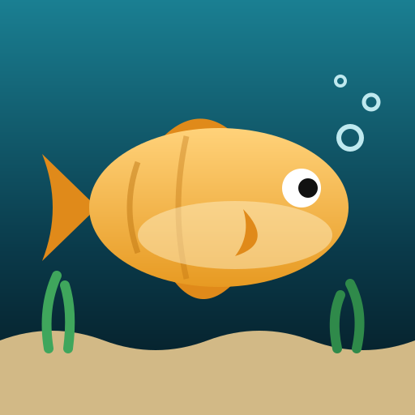

  

# Mijn aquarium

Een mobiele webapp om je vangsten te loggen. Elke vis die je vangt (met foto, soort, lengte en gewicht) gaat zwemmen in je eigen virtuele aquarium. De vis is groter of kleiner naargelang de echte vangst.

## Functies

- Vangsten toevoegen met verplichte foto, soort, lengte en gewicht
- Gewicht schatten uit lengte (en omgekeerd) met een formule per soort
- Meerdere aquariums per gebruiker, privé of openbaar
- Decor (zeewier, gras, rots, wortelhout, kasteel) dat je zelf plaatst, sleept en schaalt
- Vrienden toevoegen en hun openbare aquariums bekijken
- Tik op een vis om de foto en de gegevens te zien
- Zoomknoppen om kleine vissen beter te zien
- Soortenbeheer voor admins (vorm, kleuren, conditiefactor, max lengte)
- Mobile-first: swipen tussen pagina's, installeerbaar op het beginscherm

## Tech

- Frontend: één bestand `index.html` (HTML, CSS, vanilla JavaScript, SVG-vissen)
- Backend: [Supabase](https://supabase.com) (auth, Postgres, storage voor foto's, Row Level Security)
- Hosting: Netlify

## Zelf draaien

1. Maak een Supabase-project met de tabellen `profiles`, `species`, `aquariums`, `catches`, `decor`, `friendships` en een storage bucket `photos`.
2. Zet je eigen project-URL en publishable key bovenaan het script in `index.html`.
3. Open `index.html` lokaal of zet de map op Netlify.

Gebruik enkel de publishable (anon) sleutel in de code, nooit een `service_role` sleutel. Zet Row Level Security aan op alle tabellen.

## Project

Gemaakt als hobbyproject om vangsten op een leuke manier bij te houden.